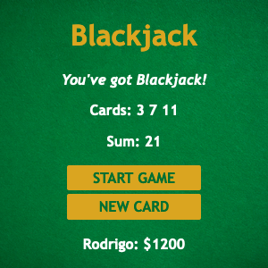

# Scrimba Frontend Career Path - (Module 3/Black Jack Game App)

This is a solution to the [Scrimba Frontend Career Path - (Module 3/Blackjack Game)](https://scrimba.com/learn/frontend).

## Table of contents

- [Overview](#overview)
  - [The challenge](#the-challenge)
  - [Screenshot](#screenshot)
  - [Links](#links)
- [My process](#my-process)
  - [Built with](#built-with)
  - [What I learned](#what-i-learned)
  - [Continued development](#continued-development)
  - [Useful resources](#useful-resources)
- [Author](#author)
- [Acknowledgments](#acknowledgments)


## Overview

### The challenge

Users should be able to Code/Understand:

- arrays
- objects
- booleans
- if else statements
- comparison operators
- logical operators
- for loops
- The Math object
- return statements

### Screenshot





### Links

- Solution URL: [https://github.com/Rod-Barbosa/black-jack-game-app](https://github.com/Rod-Barbosa/black-jack-game-app)
- Live Site URL: [https://rodrigo-blackjack-game-app.netlify.app/](https://rodrigo-blackjack-game-app.netlify.app/)

## My process

### Built with

- HTML
- CSS 
- JavaScript


### What I learned

Very good review/introductory course to basic javascript concepts

Littel detail about the startGame() function. It has this name for human reading. On the backend, startGame just calls renderGame() after setting initial variables:

```html
<button onclick="startGame()">START GAME</button>
```
```js
function startGame() {
    isAlive = true
    let firstCard = getRandomCard()
    let secondCard = getRandomCard()
    cards = [firstCard, secondCard]
    sum = firstCard + secondCard
    renderGame()
}
```

The getRandomCard() function uses a trick that can only be used when the lowest random value is 1
```js
    let randomNumber = Math.floor( Math.random()*13 ) + 1
```
For random values normally the formula is: 

```js
function randomNumGenerator (min, max){
  return Math.floor( Math.random()*(max-min+1) + min)
}
```

### Continued development

Very interesting way of teaching ht efundamentals. Maybe in the future I'll come back and code a betting function? To increase money or decrease accordinly. Let's see. As it stands, the game is sufficiently complex for what I'm reviewing.

### Useful resources

- [Random Number in JavaScript](https://stackoverflow.com/questions/4959975/generate-random-number-between-two-numbers-in-javascript) - StackOverflow always helps

## Author

- Website - [Rodrigo Portfolio](https://www.gelatodigital.com)
- Frontend Mentor - [@Rod-Barbosa](https://www.frontendmentor.io/profile/Rod-Barbosa)
- Github - [@Rod-Barbosa](https://github.com/Rod-Barbosa)

## Acknowledgments

Thank you Julie for showing me this platform
